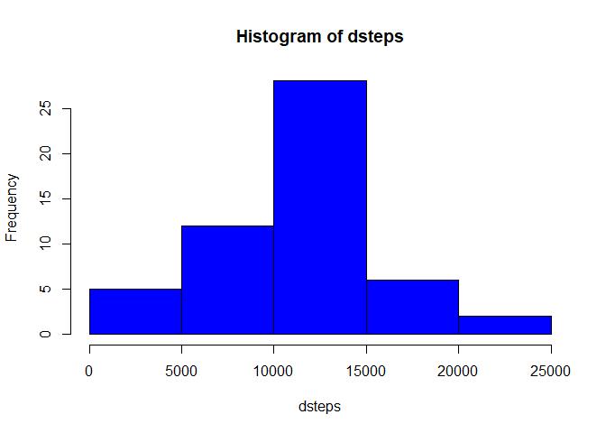
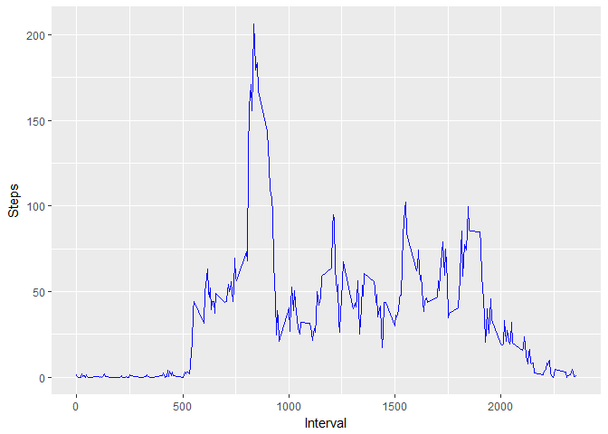
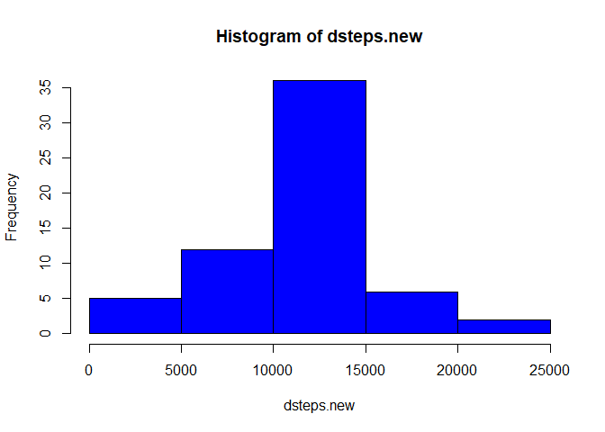
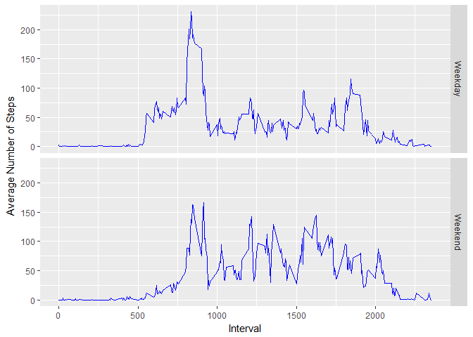

## Loading and preprocessing the data

```r
unzip("activity.zip")
activity <- read.csv("activity.csv")
activity$date <- as.Date(activity$date)
```


## What is mean total number of steps taken per day?
1. Make a histogram of the total number of steps taken each day

```r
library(ggplot2)
dsteps <- tapply(activity$steps, activity$date, FUN = sum)
hist(dsteps, col="blue", breaks = 5)
```

<!-- -->

2. Calculate and report the mean and median total number of steps taken per day

```r
mean(dsteps, na.rm = TRUE)
```

```
## [1] 10766.19
```

```r
median(dsteps, na.rm = TRUE)
```

```
## [1] 10765
```
The mean and the median of the total number of steps taken per day correspond to 10766 and 10765, respectively

## What is the average daily activity pattern?
1.Make a time series plot (i.e. type = "l") of the 5-minute interval (x-axis) and the average number of steps taken, averaged across all days (y-axis)

```r
avg_steps <- aggregate(activity$steps, by = list(activity$interval), FUN = mean, na.rm = TRUE)
names(avg_steps) <- c("interval","steps")
library(ggplot2)
qplot(interval, steps, data = avg_steps, geom = "line", color = I("blue") , xlab = "Interval", ylab = "Steps")
```

<!-- -->

2. Which 5-minute interval, on average across all the days in the data set, contains the maximum number of steps?

```r
max_step <- avg_steps$steps == max(avg_steps$steps)
avg_steps$interval[max_step]
```

```
## [1] 835
```
The 5 minutes interval witch contains the maximum number of steps is: 835.

## Imputing missing values
1. Calculate and report the total number of missing values in the data set (i.e. the total number of rows with NAs)

```r
na <- is.na(activity$steps)
sum(na)
```

```
## [1] 2304
```
The total number of missing values in the variable steps is: 2304.

2. Devise a strategy for filling in all of the missing values in the data set. The strategy does not need to be sophisticated. For example, you could use the mean/median for that day, or the mean for that 5-minute interval, etc.

My method consists in replacing the missing values with the mean of the 5-minute interval from all days generated for question 2

3. Create a new data set that is equal to the original data set but with the missing data filled in

```r
activity.split<-split(activity, activity$interval)
for (i in 1:length(activity.split)) {
    activity.split[[i]]$steps[is.na(activity.split[[i]]$steps)] <- avg_steps$steps[i]
}
activity.new <- do.call("rbind", activity.split)
```

4. Make a histogram of the total number of steps taken each day and Calculate and report the mean and median total number of steps taken per day. Do these values differ from the estimates from the first part of the assignment? What is the impact of imputing missing data on the estimates of the total daily number of steps?

```r
dsteps.new <- tapply(activity.new$steps, activity.new$date, FUN = sum)
hist(dsteps.new, col = "blue", breaks = 5)
```

<!-- -->

```r
mean(dsteps.new)
```

```
## [1] 10766.19
```

```r
median(dsteps.new)
```

```
## [1] 10766.19
```
Now we can see there's an increase in the frequency of the steps if we fill the missing values, an we can confirm this by observing the new values of the mean (10766) and of the median (10766).

## Are there differences in activity patterns between weekdays and weekends?
1. Create a new factor variable in the data set with two levels -- "weekday" and "weekend" indicating whether a given date is a weekday or weekend day.

```r
activity.new$wd <- ifelse(weekdays(activity.new$date) %in% c("sabato","domenica"), "weekend", "weekday")
activity.new$wd <- factor(activity.new$wd, labels = c("Weekday","Weekend"))
```
2. Make a panel plot containing a time series plot (i.e. type = "l") of the 5-minute interval (x-axis) and the average number of steps taken, averaged across all weekday days or weekend days (y-axis).

```r
library(dplyr)
```

```
## 
## Attaching package: 'dplyr'
```

```
## The following objects are masked from 'package:stats':
## 
##     filter, lag
```

```
## The following objects are masked from 'package:base':
## 
##     intersect, setdiff, setequal, union
```

```r
wdmean <- activity.new %>% group_by(interval,wd) %>% summarise(avg = mean(steps))
qplot(interval, avg,data = wdmean, geom = "line", facets = wd~., xlab = "Interval", ylab = "Average Number of Steps", color =I("blue"))
```

<!-- -->

There seems to be  difference between the average number of steps registered during weekdays and weekends.
